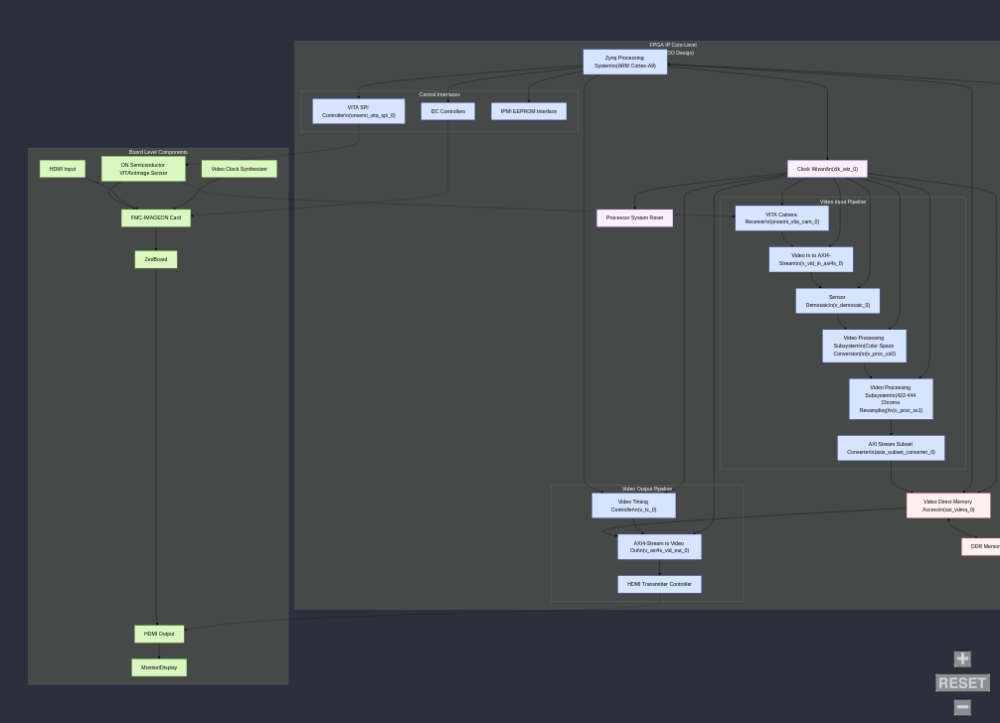
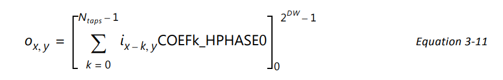

# cpre488-mp2

## Introduction

## Development

Initialize the `Vivado_init.tcl` script to set up your Vivado environment startup script.
```shell
python3 init.py
```

Run the `Vivado/gen_src.tcl` script to generate the IP cores and other sources from the Vivado project configuration.

```bat
cd %userprofile%
```

## Report 

Tasks:

- [x] [detailed system diagram](#detailed-system-diagram)
- [ ] [starter hardware operation intentions](#starter-hardware-operation-intentions)
- [ ] [changes mande to camera_app.c](#changes-mande-to-camera_app.c)
- [ ] [why at this point, camera has no color](#why-at-this-point-camera-has-no-color)
- [ ] The image pipeline should proceed from vita -> vid_in -> v_demosaic_0 -> v_proc_ss0 (Color Conversion Only) -> v_proc_ss1 (422-444 Chroma Resampling Only) -> axis_subset_converter -> vdma_S2MM -> vdma_MM2S -> vid_out -> hdmi_out. Provide a diagram for this awesome pipeline in your writeup, making sure to label the bit width of the relevant signals.
- [ ] In your writeup, describe the performance of your image processing pipeline (in terms of frames per second), and how you measured it.
- [ ] 1) Note that several of these ports in the XDC file are paired together, with one port ending in _p and the other ending in _n. In your writeup, briefly describe what this pairing of signals signifies, and what this configuration is typically used for.
- [ ] 2) We convert the 8-bit output of the “Video In to AXI4-Stream” IP core to 16-bits to be given to the VDMA by appending the 8-bit value “10000000” (see step 3.vii),. Explain why this is an appropriate value to append, and why appending “00000000” would not make sense.
- [ ] Provide your Matlab Prototype software and your original RGB image, corresponding Bayer image, and final output of your conversion algorithm in a folder named part5/
- [ ] In your writeup, describe the performance of your software-based color conversion (in terms of frames per second), and how you measured it. Overall this is a non-trivial piece of software, so put in a good faith effort for this part and in your writeup, describe your testing methodology. If you get really stuck, fork your project so that you can continue to work on the remaining system design parts.
- [ ] The YCbCr 4:2:2 pattern is an example of an encoding scheme referred to as chroma subsampling: http://en.wikipedia.org/wiki/Chroma_subsampling#4:2:2. Because the human visual system is less sensitive to the position and motion of color than it is to luminance, bandwidth can be optimized by storing more luminance detail than color detail. Look at the VDMA initialization code in function fmc_imageon_enable(), and infer from the Red, Green, and Blue examples how the 16-bit 4:2:2 YCbCr format is encoded. Briefly describe this in your writeup, and use this format as the output of your camera_loop() conversion pass.

## detailed system diagram 

The following diagram illustrates the interconnection between the various modules in the
system, both at the IP core level (i.e. the components in our VIVADO design) as well as the board
level (i.e. the various chips that work together to connect the output video to the monitor).



## Starter Hardware Operation Intentions

The following is a list of the intended operations of the given start mp-2 design hardware.

## changes mande to camera_app.c

Describe in your writeup what changes you made, and save a copy of any files modified (presumably only camera_app.c and fmc_imageon_utils.c) during this process into a folder named part3.

### Test Pattern Generation Version:

#### 1. Camera Configuration Adjustments
- **VITA Camera vs. TPG:**
  - **Original:**
  - The VITA camera configuration lines were **commented out**:
    ```c
    //    config->uBaseAddr_VITA_SPI = XPAR_ONSEMI_VITA_SPI_0_S00_AXI_BASEADDR;
    //    config->uBaseAddr_VITA_CAM = XPAR_ONSEMI_VITA_CAM_0_S00_AXI_BASEADDR;
    ```
    - The TPG (Test Pattern Generator) configuration was active:
    ```c
    config->uBaseAddr_TPG_PatternGenerator = XPAR_V_TPG_0_S_AXI_CTRL_BASEADDR;
    ```
    
  - **New:**
    - The VITA camera configuration lines are now **active** (uncommented), enabling the use of a VITA camera for video input:
      ```c
      config->uBaseAddr_VITA_SPI = XPAR_ONSEMI_VITA_SPI_0_S00_AXI_BASEADDR;
      config->uBaseAddr_VITA_CAM = XPAR_ONSEMI_VITA_CAM_0_S00_AXI_BASEADDR;
      ```
    - The TPG configuration line has been **commented out**, meaning the TPG is no longer used for video input:
      ```c
      //config->uBaseAddr_TPG_PatternGenerator = XPAR_V_TPG_0_S_AXI_CTRL_BASEADDR;
      ```
      
#### 2. Frame Processing Loop Modifications
- **Original Loop:**
  - The loop processed 1000 frames by simply **reversing the order** of pixels in each frame:
    ```c
    for (j = 0; j < 1000; j++) {
        for (i = 0; i < 1920*1080; i++) {
            pMM2S_Mem[i] = pS2MM_Mem[1920*1080-i-1];
        }
    }
    ```
  - This operation would output a horizontally reversed frame.

- **New Loop:**
  - The loop now **iterates in steps of 2**, processing the frame data as pairs of 16-bit words.
  - **Data Extraction and Processing:**
    - **U and V channels** are extracted from the high bytes of two consecutive 16-bit words.
    - **Luminance (Y)** is constructed from the low bytes of these words.
    - The luminance is **halved** (`y /= 2;`), which reduces the brightness.
    - Finally, the processed U, Y, and V values are reassembled and stored back into the destination memory:
      ```c
      for (j = 0; j < 1000; j++)
      {
          for (i = 0; i < 1920*1080; i += 2)
          {
              uint8_t u, v = 0;
              uint16_t y = 0;
  
              u = (pS2MM_Mem[i] & 0xFF00) >> 8;
              v = (pS2MM_Mem[i + 1] & 0xFF00) >> 8;
              y = (pS2MM_Mem[i] & 0xFF) | ((pS2MM_Mem[i + 1] & 0xFF) << 8);
  
              // Half luminance
              y /= 2;
  
              // Set from YUV values.
              pMM2S_Mem[i] = (u << 8) | (y & 0xFF);
              pMM2S_Mem[i + 1] = (v << 8) | ((y & 0xFF00) >> 8);
          }
      }
      ```
  - **Outcome:** Rather than simply reversing the frame, the new processing modifies the frame by reducing its brightness (halving the luminance) while maintaining the U and V (chrominance) values.

### Software Processing Version:

#### 1. Header and Library Inclusions

- **Original Pipeline:**  
  - Includes only `"camera_app.h"` and `"xil_types.h"`.  
  - The processing logic operates directly on the pixel data without invoking any additional image processing functions.

- **New (Demosaicing) Pipeline:**  
  - Adds `#include <stdlib.h>` and `#include "include/demosaicing.h"`.  
  - `demosaicing.h` is a header file that contains the function declarations for the demosaicing algorithm. 
  - RGB to YCbCr conversion is performed in this definition.

#### 2. MDMA Park Pointer and Memory Pointer Adjustments

- **Original Pipeline:**  
  - Sets the MDMA park pointer to place the S2MM side on frame 0 and the MM2S side on frame 1 by OR-ing with `0x1`.  
  - The pointer to the MM2S memory frame is obtained with an offset of `+4`.

- **New (Demosaicing) Pipeline:**  
  - Configures the park pointer differently: it is set to `0x102`, indicating a different frame mapping (S2MM on frame 1 and MM2S on frame 2).  
  - Allows for switching the park pointer to remove tearing artifacts in the camera output.

#### 3. Frame Processing and Synchronization

- **Original Pipeline Processing Loop:**  
  - The loop iterates for 1000 frames.  
  - It applied a simple transformation (previously either a pixel reversal or brightness adjustment) across the entire frame without additional synchronization steps between frames.

- **New (Demosaicing) Pipeline Processing Loop:**  
  - The loop also processes 1000 frames but with a different focus:
    - **Demosaicing Step:** Each frame is processed by calling the function `run_demosaicing`, which converts raw sensor data (Bayer pattern) into a full color image.
    - **MDMA Park Pointer Synchronization:**  
      - After processing, the code modifies the park pointer (first setting it to `0x2` and later back to `0x102`) and then uses busy-wait loops to ensure that the hardware has switched frames before proceeding.
      - These extra steps ensure proper synchronization between the software processing and the MDMA hardware’s frame buffering.
  
## why at this point, camera has no color

A video mode, which records and can replay up to 5 seconds of 1080p video. (10 bonus points).
A digital zoom mode, which uses the up and down buttons to zoom in and out of the current scene.
(10 bonus points).
Various analog and digital adjustments for the gain, exposure, and other common user-configurable
digital camera settings. (2 bonus points each: up to 8pts)


## Hardware changes


4:4:4 to 4:2:2 Conversion Eq from Subsystem Documentation (PG231):


This conversion is a horizontal 2:1 decimation operation, implemented using a low-pass FIR
filter to suppress chroma aliasing. In order to evaluate output pixel ox,y, the FIR filter in the
core convolves COEFk_HPHASE0, where k is the coefficient index, ix,y are pixels from the
input image, and [ ]^M_m represents rounding with clipping at M, and clamping at m. DW is the
Data Width or number of bits per video component. Ntaps is the number of filter taps.

The predefined filter coefficients are [0.25 0.5 0.25]. 

