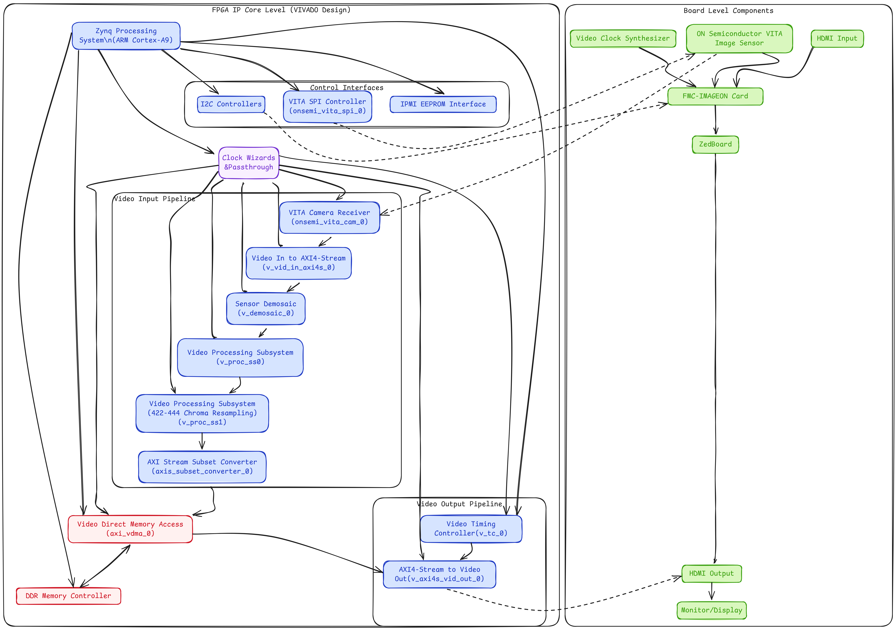
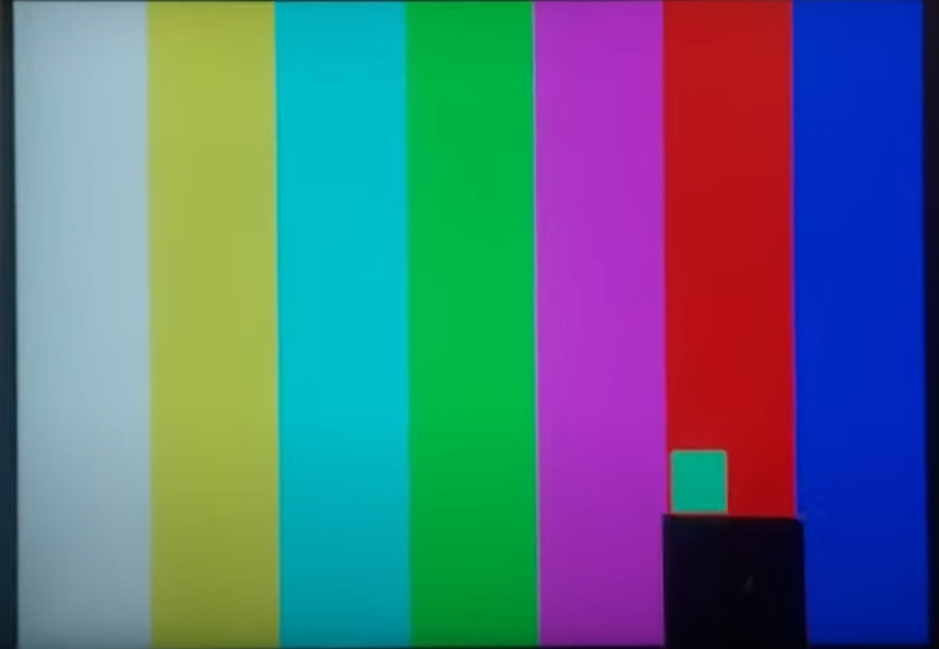
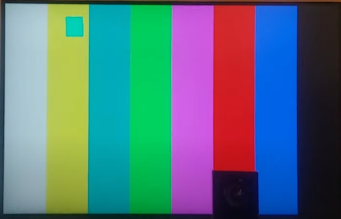
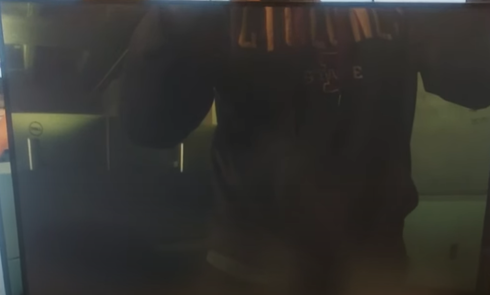
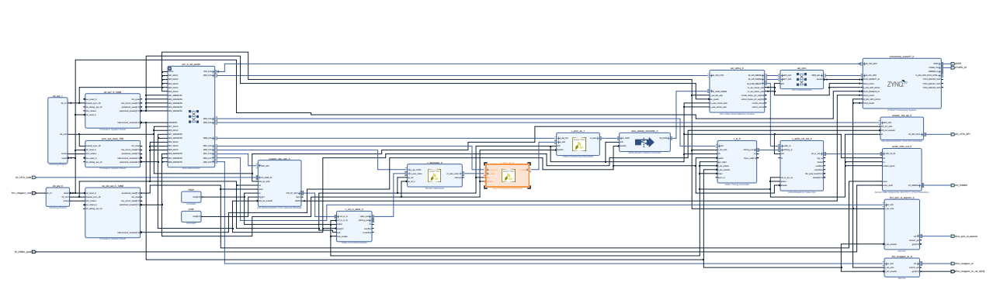
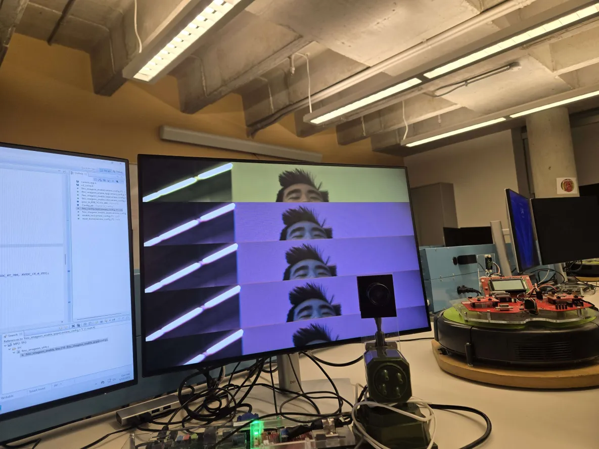
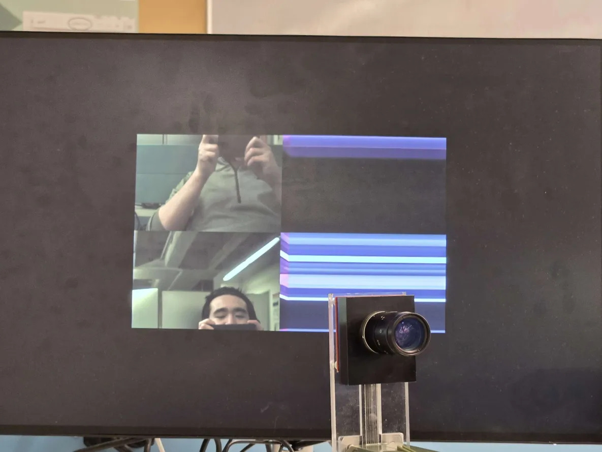
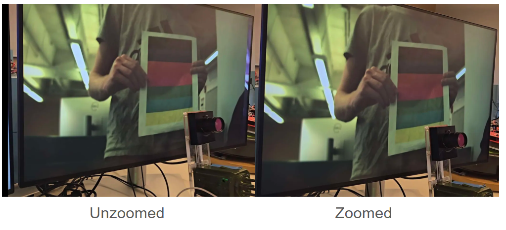
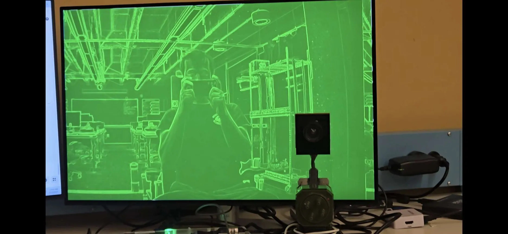

# cpre488-mp2
This repo contains my CPRE 488 MP-2 design: a Zynq-based 1080p video path that drives HDMI from a Test Pattern Generator through a read/write VDMA (with GenLock) and a Video Timing Controller to the Avnet HDMI output. It includes MMIO configuration of the TPG (moving box over color bars), a software pass that halves YUV 4:2:2 luminance in the frame buffers, notes on FMC I²C (Imageon/EEPROM), and LVDS differential-pair signaling for the VITA camera. Diagrams and a written report document the architecture, timing (100 MHz AXI, ~148 MHz pixel), and implementation details. 
# Report 

## Detailed System Diagram 

The following diagram illustrates the interconnection between the various modules in the
system, both at the IP core level (i.e. the components in our VIVADO design) as well as the board
level (i.e. the various chips that work together to connect the output video to the monitor).



## Starter Hardware Operation Intentions
The overall goal of the starter hardware to to provide an interface to FMC device such that a test image sequence can be displayed over the HDMI port on the FMC device. To accomplish this, a Test Pattern Generator IP is instantiated and configured using the AXI bus to produce a video stream that is provided to the VDMA. The VDMA is configured to store this stream to a memory location and forward the stream to an AXI Stream output IP block, which passes the stream to the AVNET HDMI Output IP block. This gives the test pattern stream a direct path to the FMC module so it can be displayed.

However, we also need to incorporate timing information. Similar to the VGA protocol, HDMI requires timing signals to make sure line draws are all synced up. To do this a Video Timing Controller IP block is used. This IP block is configured off of an AXI bus fed to it and it outputs all the timing signals that the HDMI IP block needs. These timing signals are fed into the AXI Stream to Video Out IP block, which then forwards the timing signals to the AVNET HDMI Output.

In addition, there are two I2C IP blocks, the FMC IPMI ID EEPROM I2C block and the FMC IMAGEON I2C block. The purpose of the IMAGEON interface is to provide a way for the ZYNQ processor to control the FMC peripheral. Then, the purpose of the EEPROM I2C interface is to provide the ZYNQ processor a way to configure the on-board EEPROM on the FMC, which stores important information.

For the VDMA, the primary difference between this setup and the setup from MP-0 is that the VDMA is configured for both reads and writes. There is a stream incoming from the TPG that is written to memory, and then that memory is read out to the HDMI. This requires GenLock synchronization between the reads and writes, which was not needed in MP-0.

Finally, there are two clock domains defined for this design, a 100MHz clock and a 148Mhz clock. The 100MHz clock is used for all the AXI bus transactions and is considered the primary clock. Then the 148MHz clock is used for the video clock. Looking at the block diagram, all modules that are fed a video stream use this clock and this clock is passed directly to the AVENT HDMI IP block. So, it is safe to say that the purpose of the 148MHz clock is to clock the video streams.

This design only allows for the display of the test pattern, so we need to add more IP cores later to use the camera.


## What are the changes we made to `camera_app.c`?

### TPG Change
For the TPG change, we referenced the provided datasheet to see what we configure via memory mapped registers. We saw that we had the ability to set a foreground and background to be a variety of preset patters. So, we set the background to a colored bars pattern (register value `0x9`) and the foreground to be a colored box that bounces around (register value `0x1`). Since we were enabling a box, we had to specify its dimensions and colors, which was simple to due since there were registers for each. The relevant code for this update is shown below:

```c
   // Define convenient volatile pointers for accessing TPG registers
   volatile uint32_t *TPG_CR       = (volatile uint32_t*) (config->uBaseAddr_TPG_PatternGenerator + 0);    // TPG Control
   volatile uint32_t *TPG_Act_H    = (volatile uint32_t*) (config->uBaseAddr_TPG_PatternGenerator + 0x10); // Active Height
   volatile uint32_t *TPG_Act_W    = (volatile uint32_t*) (config->uBaseAddr_TPG_PatternGenerator + 0x18); // Active Width
   volatile uint32_t *TPG_BGP      = (volatile uint32_t*) (config->uBaseAddr_TPG_PatternGenerator + 0x20); // Background Pattern
   volatile uint32_t *TPG_FGP      = (volatile uint32_t*) (config->uBaseAddr_TPG_PatternGenerator + 0x28); // Foreground Pattern
   volatile uint32_t *TPG_MS       = (volatile uint32_t*) (config->uBaseAddr_TPG_PatternGenerator + 0x38); // Motion Speed
   volatile uint32_t *TPG_CF       = (volatile uint32_t*) (config->uBaseAddr_TPG_PatternGenerator + 0x40); // TPG Color Format
   volatile uint32_t *TPG_BOX_SIZE = (volatile uint32_t*) (config->uBaseAddr_TPG_PatternGenerator + 0x78);
   volatile uint32_t *TPG_BOX_COLOR_Y = (volatile uint32_t*) (config->uBaseAddr_TPG_PatternGenerator + 0x80);
   volatile uint32_t *TPG_BOX_COLOR_U = (volatile uint32_t*) (config->uBaseAddr_TPG_PatternGenerator + 0x88);
   volatile uint32_t *TPG_BOX_COLOR_V = (volatile uint32_t*) (config->uBaseAddr_TPG_PatternGenerator + 0x90);

   xil_printf("Test Pattern Generator Initialization ...\n\r");

   // Direct Memory Mapped access of TPG configuration registers
   // See TPG data sheet for configuring the TPG for other features
   TPG_Act_H[0]  = 0x438; // Active Height
   TPG_Act_W[0]  = 0x780; // Active Width
   TPG_BGP[0]    = 0x09;  // Background Pattern
   TPG_FGP[0]    = 0x01;  // Foreground Pattern
   TPG_MS[0]     = 0x04;  // Motion Speed
   TPG_BOX_SIZE[0] = 100;
   TPG_BOX_COLOR_Y[0] = 167;
   TPG_BOX_COLOR_U[0] = 120;
   TPG_BOX_COLOR_V[0] = 8;
   TPG_CF[0]     = 0x02;  // TPG Color Format
   TPG_CR[0]     = 0x81;  // TPG Control
```


A picture of the output of this change is shown below:


### Software Only Change (TPG Registers not Modified)
For the software only change, we decided to read out the pixel colors in the YUV format and halve the luminance.  We believed that knowing the YUV format early on in the lab would be beneficial later when we have to implement SW demosaicing. The code that reads the YUV data, halves the luminance, and then writes it back is shown below:

```c
for (i = 0; i < 1920*1080; i += 2)
		{
		   uint8_t u, v = 0;
		   uint16_t y = 0;

		   u = (pS2MM_Mem[i] & 0xFF00) >> 8;
		   v = (pS2MM_Mem[i + 1] & 0xFF00) >> 8;
		   y = (pS2MM_Mem[i] & 0xFF) | ((pS2MM_Mem[i + 1] & 0xFF) << 8);

		   // Half luminance
		   y /= 2;

		   // Set from YUV values.
	       pMM2S_Mem[i] = (u << 8) | (y & 0xFF);
	       pMM2S_Mem[i + 1] = (v << 8) | ((y & 0xFF00) >> 8);
		}
```

The YUV 422 format is described later in this report.

A picture of the output from this change is shown below:



Though it is quite hard to see in this image, the luminance has be halved. My phone camera dod not pick this up well.
## In the (`.xdc`) constraints file, what does the `_p` and `_n` pairing of signals signify, and what this configuration is typically used for?

In the constraints file, the `_p` and `_n` suffix pairs indicate differential signaling, specifically LVDS (Low-Voltage Differential Signaling). This is confirmed by the IOSTANDARD setting for these signals:

```
set_property IOSTANDARD LVDS_25 [get_ports IO_VITA_CAM_clk_out_*]
set_property IOSTANDARD LVDS_25 [get_ports IO_VITA_CAM_sync_*]
set_property IOSTANDARD LVDS_25 [get_ports IO_VITA_CAM_data_*]
```

### What LVDS Is and How Does It Work?

LVDS uses a pair of complementary signals that are transmitted on two separate traces:
- The `_p` suffix indicates the positive/true signal
- The `_n` suffix indicates the negative/complement signal

The actual data is determined by the voltage difference between these two signals rather than the absolute voltage level. Typically, a small voltage difference (around 350mV) is used, where:
- A positive difference represents a logical '1'
- A negative difference represents a logical '0'

### Why Is LVDS Used for the Camera Interface?

LVDS is used for the VITA camera interface for several important reasons:

1. **High-Speed Data Transfer**: The VITA-2000 sensor needs to transfer large amounts of image data quickly. LVDS supports high-speed data rates (often above 1 Gbps per pair) as seen in the 2.692 ns clock period (approximately 371 MHz).

2. **Noise Immunity**: Since LVDS relies on the difference between two signals rather than absolute voltage, it's highly resistant to common-mode noise that would affect both lines equally.

3. **Low EMI**: The differential pairs carry equal and opposite currents, causing the electromagnetic fields to cancel out, which reduces electromagnetic interference.

4. **Signal Integrity**: The constraint file also sets differential termination for these signals:
   ```
   set_property DIFF_TERM true [get_ports IO_VITA_CAM_clk_out_*]
   set_property DIFF_TERM true [get_ports IO_VITA_CAM_sync_*]
   set_property DIFF_TERM true [get_ports IO_VITA_CAM_data_*]
   ```
   This ensures proper signal integrity by eliminating reflections.

In this design, LVDS is specifically used for:
- Clock signals (`IO_VITA_CAM_clk_out_p/n`) - to provide a stable, clean timing reference
- Synchronization signals (`IO_VITA_CAM_sync_p/n`) - for frame timing synchronization
- Data lines (`IO_VITA_CAM_data_p/n`) - carrying the actual pixel data from the sensor

## Why are we appending 10000000 to the output of the VITA-2000 camera? Also, why would it not make sense to append 00000000?

The 0x10000000 offset creates a safe "sandbox" for the video frame buffers that won't interfere with other memory usage in the system. This is particularly important for video processing which involves large, continuous memory accesses through DMA that could otherwise corrupt system memory.

It would not make sense to append 0x00000000 to the output of the VITA-2000 camera because it would almost certainly result in memory corruption as the video data would overwrite critical program memory.
  
## Why at this point, does the camera had no color?

Before implementing the demosaicing algorithm and software processing, the camera had no color because the raw data from the camera sensor is in a Bayer pattern format rather than a processed RGB or YCbCr color format.

**Bayer Pattern Sensor Format**:

The VITA-2000 camera sensor uses a Bayer filter pattern. This means each pixel captures only one color component (Red, Green, or Blue) arranged in a specific pattern.
    
**Direct Raw Data Display**: Without the demosaic and color processing enabled, the system is directly displaying the raw Bayer pattern data, which appears as a grayscale or monochrome image. Each pixel only contains intensity information for a single color, but the display treats it as luminance-only data.


## Software Demosaicing Implementation

To implement our software demosaicing C code, we simply ran it in the main `camera_loop` function, making sure to provide pointers to the data coming in and where the demosaiced data should go to. Subgroup B's code for this is shown below:

```c
		set_park_frame(&(config->vdma_hdmi), 0, XAXIVDMA_WRITE);

		// Wait until frame zero is being written to.
		while(get_current_frame_pointer(&(config->vdma_hdmi), XAXIVDMA_WRITE))
		{

		}

		set_park_frame(&(config->vdma_hdmi), 1, XAXIVDMA_WRITE);

		// Wait until frame one is being written to.
		while(!get_current_frame_pointer(&(config->vdma_hdmi), XAXIVDMA_WRITE))
		{

		}

		// Apply CFA
		run_demosaicing((uint16_t*)pS2MM_Mem, (uint16_t*)pMM2S_Mem);

		// Swap back and front buffers
		u8 temp = back_buffer_frame;

		back_buffer_frame = front_buffer_frame;
		front_buffer_frame = temp;

		// Have the read side park on the new front buffer
		set_park_frame(&(config->vdma_hdmi), front_buffer_frame, XAXIVDMA_READ);

		// Wait for park frame to update.
		while(get_current_frame_pointer(&(config->vdma_hdmi), XAXIVDMA_READ) != front_buffer_frame)
		{

		}

		// Update pMM2S_Mem to point to back buffer.
		pMM2S_Mem = (Xuint16 *)XAxiVdma_ReadReg(config->vdma_hdmi.BaseAddr, XAXIVDMA_MM2S_ADDR_OFFSET+XAXIVDMA_START_ADDR_OFFSET + (back_buffer_frame * 0x4));
```

The function `run_demosaicing` applies the demosaic operation to the incoming data and the rest of the code shown here is to manage the frame buffers. To allow for an easier time measuring the performance metrics and to remove tearing, we used the frame buffers smartly.

Since the demosaicing software takes a while to run, we take a single snapshot image, store it in frame buffer 0, and then let the VDMA write the incoming stream to frame buffer 1. Then, the deomosaicing software can run on frame buffer 0.

For displaying the image, we decided to treat two different read frame buffers as front and back buffers. The demosaicing code updates the back buffer while the read channel of the VDMA streams the front buffer contents to the HDMI interface. Then once the demosaicing software has ran, the buffers are swapped, which displays the latest processed frame. This worked quite well and removed many artifacts in our images. An example of an image that resulted from the software demosaicing is shown below (image quality is a bit poor due to my phone):


   
## YCbCr 4:2:2 Format Analysis

### Note from the Documentation
4:4:4 to 4:2:2 Conversion Eq from Subsystem Documentation (PG231):

$$
o_{x,y} = \left[\sum_{k=0}^{N_{\text{taps}}-1} i_{x-k,y}\, \text{COEF}_{k,\text{HPHASEO}}\right]_0^{2^{D_w}-1}
$$


Equation 3-11

This conversion is a horizontal 2:1 decimation operation, implemented using a low-pass FIR filter to suppress chroma aliasing. In order to evaluate output pixel $o_x$,$o_y$, the FIR filter in the core convolves COEFk_HPHASE0, where k is the coefficient index, $i_x$,$i_y$ are pixels from the input image, and $[ ]^M_m$ represents rounding with clipping at M, and clamping at m. DW is the Data Width or number of bits per video component. Ntaps is the number of filter taps. The predefined filter coefficients are `[0.25 0.5 0.25]`. 

### Primary Analysis
In the YCbCr 4:2:2 format, each 32-bit word (0xF0525A52, 0x36912291, 0x6E29F029) contains data for two adjacent pixels. Breaking down these values:

```c
// Frame #1 - Red pixels
for (i = 0; i < storage_size / config->uNumFrames_HdmiFrameBuffer; i += 4) {
  *pStorageMem++ = 0xF0525A52;  // Red
}
```

1. **Red Example (0xF0525A52)**:
   - This represents two pixels in sequence
   - First 16 bits (0xF052): Y1=0xF0, Cb=0x52
   - Second 16 bits (0x5A52): Y2=0x5A, Cr=0x52
   
```c
// Frame #2 - Green pixels
for (i = 0; i < storage_size / config->uNumFrames_HdmiFrameBuffer; i += 4) {
  *pStorageMem++ = 0x36912291; // Green
}
```
2. **Green Example (0x36912291)**:
   - First 16 bits (0x3691): Y1=0x36, Cb=0x91
   - Second 16 bits (0x2291): Y2=0x22, Cr=0x91
   
```c
// Frame #3 - Blue pixels
for (i = 0; i < storage_size / config->uNumFrames_HdmiFrameBuffer; i += 4) {
  *pStorageMem++ = 0x6E29F029;  // Blue
}
```
3. **Blue Example (0x6E29F029)**:
   - First 16 bits (0x6E29): Y1=0x6E, Cb=0x29
   - Second 16 bits (0xF029): Y2=0xF0, Cr=0x29

The pattern for each color follows the YCbCr 4:2:2 format where:
- Each 16-bit word contains one Y (luminance) value and one chrominance (Cb or Cr) value
- The chrominance values alternate between Cb and Cr
- Two adjacent pixels share the same Cb and Cr values (the subsampling)

## Format Structure

The 4:2:2 format packs data as follows for each pair of pixels:
```
[Y1][Cb][Y2][Cr]
```

Where:
- Y1: Luminance for first pixel
- Cb: Blue color difference (shared between two pixels)
- Y2: Luminance for second pixel
- Cr: Red color difference (shared between two pixels)

This format maintains full luminance resolution (the "4" in 4:2:2) while halving the horizontal resolution of the color information (the "2:2"). This works well because human vision is more sensitive to changes in brightness than in color.

For the `camera_loop()` function's conversion pass, this format would need to be maintained when processing the data, ensuring that each 32-bit word continues to represent two pixels in the YCbCr 4:2:2 format, with the appropriate luminance and chrominance values preserved during the vertical flip operation.

## Image Processing Pipeline

Below is the resulting block diagram after adding the pipeline (we did not have enough time to update our original diagram, we have provided a description of the changes below):



The pipeline consists of an IP block that does demosaicing to the incoming video stream and two video processing modules. One of the video processing modules converts the RGB output from the demosaicing module to YUV 444 then the other video processing module converts the YUV 444 data to YUV 422, which is what the FMC IMAGEON module expects. The output from the YUV 444 to YUV 422 is then passed through an AXI Stream Converter and is then passed to the VDMA like before. So in summary, three pipeline stages were added:

1. Demosaicing
2. RGB to YUV 444 Conversion
3. YUV 444 to YUV 422 Conversion 

## Performance

### Introduction (how we measured performance)

We measured the performance of the software and hardware pipelines in this design utilizing interrupt-driven time measurements. Using interrupts allows the software to be aware when a frame is read or written by the VDMA. Then by using timers, we can get extremely accurate frame write times, which can be used to derive the resulting average frames per second (FPS). 

### Software Pipeline 

#### Performance
For subgroup B, we determined that the average frame rate is `0.396 FPS`

This is quite slow, which is due to the software demosaicing algorithm not being optimized well and the fact that over 2 million half-word writes are required to process a single image!

#### Testing Methodology
As previously stated, we used interrupts and timers to measure the FPS. We setup interrupts for the VDMA read channel frame completion and the write channel frame completion. This allowed us to know when frames were written to the VDMA and read from the VDMA. However, we had to find a solution to isolate the frame that is being processed since we don't shut down the VDMA. 

To do this, we stored a single frame in frame buffer 0, which the demosaicing software ran on. Then, once the demosaicing was finished, we updated the VDMA read channel to read this new frame out. By using the park pointer VDMA registers, we were able to detect when this new frame was written out and start/stop timers accordingly on this event. By comparing the current write time to the previous write time, we can determine how long it took to write out the last frame, which gives us our FPS value! Finally, we averaged 10 FPS values together to produce a final FPS value!

The interrupt service routines and park pointer register modification code is shown below:

Globals
```c
// Timing globals
static fps_t fps;
static int sw_mode = 0;
static int snapshot_saved = 0;

static u8 back_buffer_frame = 2;
static u8 front_buffer_frame = 3;

// Frame that indicates that the write completed.
static u8 target_frame = 2;

static XTime tStart, tEnd = 0;

// In seconds
static float frame_time = 0;
```

ISRS:
```c
void video_frame_output_isr(void* CallBackRef, u32 InterruptTypes)
{
	switch(InterruptTypes)
	{
		case XAXIVDMA_IXR_FRMCNT_MASK:
		{
			// Once we have read from the back buffer, we know that it is the new front buffer
			// so we must have just swapped.
			if(sw_mode && (get_current_frame_pointer((XAxiVdma*) CallBackRef, XAXIVDMA_READ) == target_frame) && snapshot_saved)
			{
				// We start and stop the timer on this ISR.
				// If this is the first frame, the timer won't be started, so start it up without ending any timer.
				if(!tStart)
				{
					XTime_GetTime(&tStart);
				}
				else
				{
					XTime_GetTime(&tEnd);
					snapshot_saved = 0;

					frame_time = (tEnd - tStart) / (float)COUNTS_PER_SECOND;

					fps_time_store(&fps, frame_time);

					sprintf(fps_msg, "Average FPS: %.5f", fps_calculate(&fps));

					xil_printf("%s\n\r", fps_msg);

					// Start the timer back up!
					XTime_GetTime(&tStart);
				}

			}
		}

		default:
		{
			break;
		}
	}
}
void camera_input_isr(void* CallBackRef, u32 InterruptTypes)
{
	switch(InterruptTypes)
	{
		case XAXIVDMA_IXR_FRMCNT_MASK:
		{
			if(sw_mode && get_current_frame_pointer((XAxiVdma*)CallBackRef, XAXIVDMA_WRITE) == 0 && !snapshot_saved)
			{
				snapshot_saved = 1;
				target_frame = back_buffer_frame;
			}
		}

		default:
		{
			break;
		}
	}
}
```

Park Pointer Register Modifications
```c
		set_park_frame(&(config->vdma_hdmi), 0, XAXIVDMA_WRITE);

		// Wait until frame zero is being written to.
		while(get_current_frame_pointer(&(config->vdma_hdmi), XAXIVDMA_WRITE))
		{

		}

		set_park_frame(&(config->vdma_hdmi), 1, XAXIVDMA_WRITE);

		// Wait until frame one is being written to.
		while(!get_current_frame_pointer(&(config->vdma_hdmi), XAXIVDMA_WRITE))
		{

		}

		// Apply CFA
		run_demosaicing((uint16_t*)pS2MM_Mem, (uint16_t*)pMM2S_Mem);

		// Swap back and front buffers
		u8 temp = back_buffer_frame;

		back_buffer_frame = front_buffer_frame;
		front_buffer_frame = temp;

		// Have the read side park on the new front buffer
		set_park_frame(&(config->vdma_hdmi), front_buffer_frame, XAXIVDMA_READ);

		// Wait for park frame to update.
		while(get_current_frame_pointer(&(config->vdma_hdmi), XAXIVDMA_READ) != front_buffer_frame)
		{

		}

		// Update pMM2S_Mem to point to back buffer.
		pMM2S_Mem = (Xuint16 *)XAxiVdma_ReadReg(config->vdma_hdmi.BaseAddr, XAXIVDMA_MM2S_ADDR_OFFSET+XAXIVDMA_START_ADDR_OFFSET + (back_buffer_frame * 0x4));
```
### Hardware Pipeline 

#### Performance
For subgroup B, we determined that the average frame rate is `59.794 FPS`

This is what we expect since the timing was setup for 60Hz writes, which is 60 times a second.

#### Testing Methodology
The testing methodology used for the hardware pipeline is quite similar to what we used for the software pipeline. We made use of VDMA read and write interrupts and the processing system timers to record the time passed between frame writes. However, since we don't have to wait on C code to run, we did not need to single out a frame and keep track of it. We could simply let the VDMA run with a few conditions to make sure we are recording the times fine:

- A VDMA write must happen before a VDMA read can occur. We need to take into consideration the VDMA write time.
- Only record times between VDMA reads to two different frame buffers. If multiple reads are done on the same frame buffer, we know that the write channel is lagging behind, so we should wait until the frame buffer counter increments.

The interrupt service routines that implement this are shown below:

```c
void video_frame_output_isr(void* CallBackRef, u32 InterruptTypes)
{
	switch(InterruptTypes)
	{
		case XAXIVDMA_IXR_FRMCNT_MASK:
		{
			u8 current_frame = get_current_frame_pointer((XAxiVdma*) CallBackRef, XAXIVDMA_READ);

			// Make sure we received something before recording that we wrote it.
			if(rec_flag && (current_frame != prev_frame))
			{
				// If first frame, start only
				if(!tStart)
				{
					XTime_GetTime(&tStart);
				}
				else
				{
					XTime_GetTime(&tEnd);

					fps_reading = (tEnd - tStart) / (float)COUNTS_PER_SECOND;

					fps_time_store(&fps, fps_reading);

#if OUTPUT_FPS
					sprintf(fps_msg, "Average FPS: %.5f", fps_calculate(&fps));

					xil_printf("%s\n\r", fps_msg);
#endif

					// Start the timer back up!
					XTime_GetTime(&tStart);
				}

				rec_flag = 0;
			}

			prev_frame = current_frame;
		}

		default:
		{
			break;
		}
	}

}

// Does nothing as of now. All timer operations are done when a frame is drawn to the screen.
void camera_input_isr(void* CallBackRef, u32 InterruptTypes)
{
	switch(InterruptTypes)
	{
		case XAXIVDMA_IXR_FRMCNT_MASK:
		{
			if(!rec_flag)
			{
				rec_flag = 1;
			}
			break;
		}


		default:
		{
			break;
		}
	}

}
```

Overall, it was quite tedious to get interrupts working, but it definitely paid off!

## Bonus Credit

The following sections describe the bonus credit tasks that were completed for this project and how they were implemented/accomplished.

### Various analog and digital adjustments for the gain, exposure, and other common user-configurable digital camera settings. 

We implemented the following adjustments:
- Contrast
- Brightness
- Saturation

These were implemented by leveraging the second Subsystem which converts 4:4:4 to 4:2:2 and the `xvprocss.h` defined utilities.

#### Gain

### 1. Brightness Adjustment

**Explanation:**  
The brightness level is adjusted dynamically through a dedicated function. When invoked (for example, via board buttons), it calls the hardware API to update the brightness level of the processed video image.

**Code Sample:**
```c
void set_brightness(
    camera_config_t *config,
    int percent // Brightness level as a percentage
)
{
   if (config->bVerbose)
   {
      xil_printf("Setting brightness to %d\n\r", percent);
   }
   // Apply the brightness adjustment using the video processing subsystem
   XVprocSs_SetPictureBrightness(&proc_ss_RGB_YCrCb_444, (s32)percent);
}
```


### 2. Contrast Adjustment

**Explanation:**  
Similarly, contrast is adjusted using a dedicated function that calls the hardware API to modify the contrast level. This allows users to dynamically control the difference between light and dark areas in the image.

**Code Sample:**
```c
void set_contrast(
    camera_config_t *config,
    int percent // Contrast level as a percentage
)
{
   if (config->bVerbose)
   {
      xil_printf("Setting contrast to %d\n\r", percent);
   }
   // Apply the contrast adjustment using the video processing subsystem
   XVprocSs_SetPictureContrast(&proc_ss_RGB_YCrCb_444, (s32)percent);
}
```

### 4. Saturation Adjustment

**Explanation:**  
The saturation adjustment function controls the vividness of the colors in the video output. This function calls the corresponding hardware API to adjust the saturation level in the YCrCb color space.

**Code Sample:**
```c
void set_saturation(
    camera_config_t *config,
    int percent // Saturation level as a percentage
)
{
   if (config->bVerbose)
   {
      xil_printf("Setting saturation to %d\n\r", percent);
   }
   // Apply the saturation adjustment using the video processing subsystem
   XVprocSs_SetPictureSaturation(&proc_ss_RGB_YCrCb_444, (s32)percent);
}
```

Using the buttons on the board (code resused from mp-1), the user can adjust the gain, contrast, brightness, and saturation. 

### A video mode, which records and can replay up to 5 seconds of 1080p video. 

Video mode was about decreasing the delay from image to image in the play mode and increasing the number of images that can be stored in the software. This was done by removing the 2-second delay in image capture and increasing the heap size to correspond with the increased number of stored images.


**Code Sample:**
```c
_HEAP_SIZE = DEFINED(_HEAP_SIZE) ? _HEAP_SIZE : 0x19000000;
```

### A digital zoom mode, which uses the up and down buttons to zoom in and out of the current scene.

The digital zoom was implemented partially through the crop and scale capabilities of the fully fledged Video Processing Subsystem (v2.2) IP core. According to the embedded drivers for the IP, the VPSS has a zoom and scale core that can be used to perform a digital zoom by relaying display information in a user-specified window that can then be scaled to a desired dimension. To do this, I opted to add a separate core in addition to the two used in the original hardware pipeline for colour space conversion and chroma sampling, as I worried the additional operations could cause timing issues during the video processing. The final pipeline was as follows: Demosiac -> Zoom and Scale VPSS -> CSC VPSS -> 444:422 VPSS -> VDMA. Unfortunately, the driver documentation leaves something to be desired and there lacks an accessible example for this design. This resulted in an awfully heuristic design process, which ultimately produced a rather lackluster product. However, a product nonetheless. Although it still suffers from artifacts, a digital zoom of at most 85% of the original resolution was achieved before the video became distorted and corrupted. An example of the corrupted image can be seen below:



As the zoom increased past the 85% threshold, only a small segment of the top of the display would repeat. This segment seemed like it would duplicate and shrink as the zoom factor increased. Originally, I had believed that the issue lied in the output resolution of the zoom core being incompatible with the HDMI. For example, when I played around with the picture in picture mode, a similar artifact manifested - as seen below:



For that reason, I figured that using the horizontal and vertical scaler cores could help align the output video resolution. However, I was unsure as to how to properly sequence the core configurations as there was a lack of relative documentation. Looking at the AMD forums, it seemed that many people experiencing similar artifacts blamed unaligned VDMA writes or bandwidth bottlenecks. In an attempt to address the VDMA issues, I tried to dynamically reconfigure the VDMA such that it could scale the non-1080p output of the zoom core to 1080p for the HDMI. I also tried allowing for unaligned VDMA reads and writes. Neither of these worked. I also wanted to try increasing the sample rate of the hardware pipeline to 2 or more pixels per clock, but I ran out of time before I could test this hypothesis. 

In the end, I was able to perform a digital zoom in some way, as seen (barely) in the following image:



### Sobel Edge Detector

The Sobel edge detector was implemented through software - in a similar manner to the Bayer reconstruction software. This meant the operation could be achieved with the following convolution algorithm:

```
// Kernels
uint32_t i, j, gx, gy = 0;
uint32_t mx[3][3] = {
	{-1, 0, 1},
	{-2, 0, 2},
  {-1, 0, 1}
};
  uint32_t my[3][3] = {
	{-1, -2, -1},
	{0, 0, 0},
  {1, 2, 1}
};

// Convolution
for (int x = 0; x < 1000; x++) {
  for (i = 1; i < 1080 - 2; i++) {
    for (j = 1; j < 1920 - 2; j++) {
      uint32_t r, t = 0;
      uint32_t gx = 0, gy = 0;
        for (r = 0; r < 3; r++) {
          for (t = 0; t < 3; t++) {
	 					uint32_t image_index = (i + r - 1) * 1920 + (j + t - 1);
	 					uint32_t pixel_value = pS2MM_Mem[image_index];
	 					gx += pixel_value * mx[r][t];
	 					gy += pixel_value * my[r][t];
	 				}
	 			}
	      uint32_t output = sqrt(gx*gx + gy*gy);
	      pMM2S_Mem[i * COL_SIZE + j] = output;
	  }
  }
}
```

The resulting effects can be seen below:



It should be noted that a better result could have been achieved should only luminance value be used, but I ran out of time before I could implement it.  

