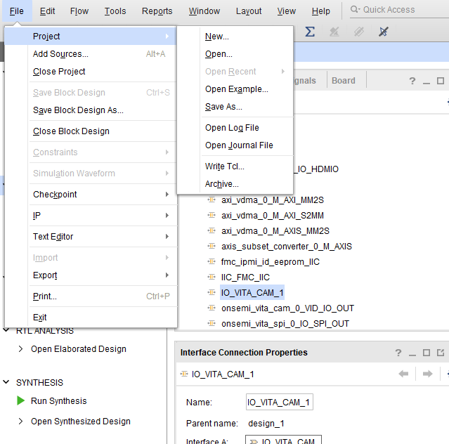
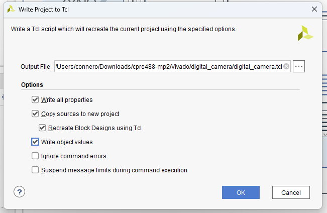

# CPRE 488 MP2

Conner Ohnesorge - Nolan Eastburn

Jason Xie - Owen Parker

---

Initial Setup/Design


---

Image Pipeline


---

# Fixing Vivado Git 

Export Project as tcl script.



---

# Fixing Vivado Git

Select required options for project.



---
# Fixing Vivado Git

You may need to modify the tcl script to include the correct files from a static location in the repo.

For example, in our case, we had to statically define places for:
- Constraints File
- VHDL Files (`design_1_wrapper.vhd`)
- HW IP Files (`avnet_hdmi_out`, `avnet_hdmi_in`, `interfaces`, `onsemi_vita_cam`, `onsemi_vita_spi`)

---

# Fixing Vivado Git


Tree view of the hardware pipelined vivado folder structure (with some files removed for clarity)
```bash
.
├── Constraints
│   └── master.xdc
├── design_1.pdf
├── digital_camera_pipeline.tcl
├── hw
│   └── IP
│       ├── avnet_hdmi_in
│       ├── avnet_hdmi_out
│       ├── interfaces
│       ├── onsemi_vita_cam
│       └── onsemi_vita_spi
└── VHDL
    └── design_1_wrapper.vhd
```


---

# Fixing Vivado Git

Add and Commit tcl script.

```bash
git add digital_camera_pipeline.tcl
git commit -m "added digital_camera_pipeline.tcl"
```

---

# Fixing Vivado Git

Upon clone of repo, cd to repo directory and execute generate tcl script.

```bash
git clone https://github.com/conneroisu/cpre488-mp2.git
# IN VIVADO TCL CONSOLE -> 
# cd C:/Users/connero/Downloads/cpre488-mp2/Vivado/digital_camera_pipeline

# IN VIVADO TCL CONSOLE -> 
# source digital_camera_pipeline.tcl
## OR
# TOOLS -> 
# Run Tcl Script (opens explorer then select tcl script)
```
---

# Fixing Vivado Git 

Vivado Folder `.gitignore`
```gitignore
!*
.Xil/*
project_1/*
digital_camera/*
*.str
```

---

Thank You
